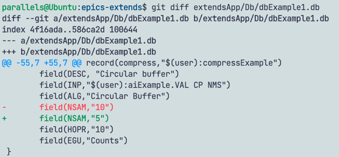
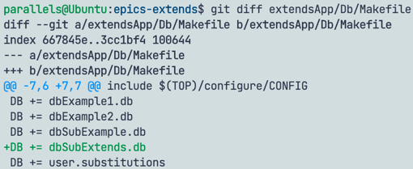
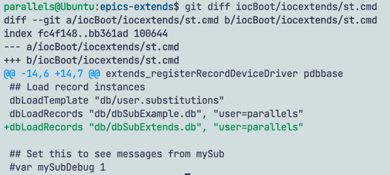
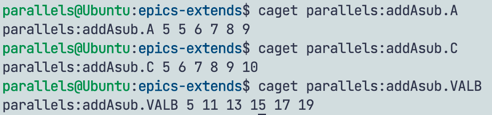

# Subroutine/Array Subroutine 扩展函数使用指南

---

## subRecord


## aSubRecord

### addAsub(aSubRecord *prec)

该函数将field`A...U`中数组元素数量(`NOA...NOU`)大于1的所有数组相加，并将结果存放至指定的字段(`VALA...VALU`)。

支持数据类型：`SHORT/USHORT/LONG/ULONG/FLOAT/DOUBLE`

**使用该函数需注意：**


1. 选择一个output field

    1. 设置元素数量`NOVA...NOVU`和数据类型`FTVA...FTVU`, 元素数量大于1的field作为output field, 其对应的数据类型作为本次运算的基准类型;
    2. 当record有多个设置，则按`NOVA->NOVU`的顺序取第一个符合条件的field作为output field。

2. 选择input field

   1. 设置元素数量`NOA...NOU`和数据类型`FTA...FTU`, 只有元素数量大于1的field被认为有效字段，参与运算；
   2. input field的有效字段的元素数量、数据类型，必须和output field保持一致；

**One Example**

新建 extendsApp/Db/dbSubExtends.db

```sh
# A + C -> VALB, number of elements is 5, field type is unsigend long
record(aSub,"$(user):addAsub")
{
    field(SCAN, "10 second")
    field(SNAM, "addAsub")
    field(FTA, "ULONG")
    field(FTC, "ULONG")
    field(NOA, "5")
    field(NOC, "5")
    field(INPA, "$(user):compressExample.VAL NPP NMS")
    field(INPC, "$(user):myCompress.VAL NPP NMS")
    field(NOVB, "5")
    field(FTVB, "ULONG")
}

record(calc, "$(user):myCalc")
{
    field(DESC, "Counter")
    field(INPA, "$(user):aiExample.VAL CP NMS")
    field(CALC, "A+1")
}

record(compress, "$(user):myCompress")
{
    field(ALG, "Circular Buffer")
    field(INP, "$(user):myCalc.VAL CP NMS")
    field(NSAM, "5")
}
```

修改extendsApp/Db/dbExample1.db



在extendsApp/Db/Makefile添加`dbSubExtends.db`



在iocBoot/iocextends/st.cmd添加`dbSubExtends.db`



运行iocBoot/iocextends/st.cmd, 查看计算结果



